# Structural ambiguity in lipidomics, the honest version

A few weeks ago I published a post about expressing structural ambiguity in CXSMILES. John Mayfield, who maintains much of the CDK support for CXSMILES, was kind enough to read it and point out where I had it wrong. He was right, and in several places. This is the correction.

I am not going to defend the old notation. The old post proposed four CXSMILES devices: `ctu:` for unknown double-bond geometry, `f:` for unresolved sn assignment, `Sg:` with a raw `a+b=15` constraint for unknown double-bond position, and `m:` for unknown modification position. The first three were wrong in ways that matter, and the confidence handling was throwing information away. Let me go through each.

## What the first version got wrong

### `ctu:` is a query feature, not a structure declaration

CXSMILES has a `ctu:` field, and it looks exactly like what you want for "this double bond could be cis or trans". But `ctu:` is a query feature. It exists so a search can match either geometry. It is not a statement about a structure. A bare `C=C` in SMILES already means the geometry is undetermined. Writing `ctu:` on top of it was redundant, and it told a reader the wrong thing about what the string was.

In the new format we simply leave the bond alone. `FA 18:1(9)` produces a plain `C=C`, which every SMILES reader already understands. Nothing is added.

### `f:` had the wrong cardinality, and RDKit does not implement it

The old encoding put unresolved sn assignment into `f:0.1.2`, a CXSMILES fragment group. Three things were wrong with that.

First, the fragment grouping reads as an R-group, and an R-group states the wrong cardinality. Under the ordinary Markush reading, one label with N definitions substitutes each of its sites independently. So `PC 16:0_18:1` would also admit `PC 16:0/16:0`, and a TG permitted 27 assignments where the name allows 6. Nothing in the string said whether definitions are substituted independently or paired positionally.

Second, an `RG:` definition cannot contain a nested `|...|` block. CDK rejects it. So a chain that needed an `Sg:` or `m:` block of its own could never be an R-group alternative. That forced a choice between saying the double bond was unlocalized and saying the sn assignment was unresolved. The old encoding kept the double bond and dropped the sn ambiguity silently.

Third, RDKit does not implement `RG:` at all, not even the minimal case. Any string we emitted with `f:` would parse in CDK but fail in RDKit.

The fix is to stop grouping fragments. The chains are written directly into the main string, each chain gets an atom label, and the sn statement moves to the trailer. I will show this below.

### The raw constraint was not a feature

The old format wrote the chain-length constraint as a raw expression after the pipes: `a+b=15`. This borrowed the look of a CDK cookbook size constraint, but it was not a defined CXSMILES feature. A reader could not know what it meant, and it was easy to confuse with something a toolkit would interpret as a name.

The new format wraps it in an explicit token: `constrain(a+b=15)`. It says clearly what it is, and it lives where every non-standard statement lives now, after the pipes in the trailer.

### Confidence was thrown away

The old post argued that confidence should not go into CXSMILES, and used a `~` notation in the name such as `18:1(9~80%,11~20%)`. But when the structure was built, the consensus tail was stripped and discarded. The percentages survived only in the name column.

The new format keeps the consensus. It moves into the trailer as `dbPos(...)` and `mPos(...)` tokens, and `smiles2name` reconstructs the original bracketed tail from them. Nothing is thrown away anymore.

## The design rule

The whole revision reduces to one rule:

> Everything the standard covers goes inside the pipes, correct and complete. Everything it does not goes after them, where no toolkit can mistake it for structure.

The part before and inside `|...|` is ordinary, conformant CXSMILES. A toolkit that knows nothing about lipids parses it, renders it, and gets a chemically valid molecule. Nothing lipid-specific is smuggled into a standard field, and no standard field is given a private meaning.

The part after the closing pipe is the title field. A SMILES reader treats a title as the molecule's name, never as structure. CDK Depict prints it under the picture unless asked not to. RDKit stores it in `_Name` and drops it when it writes the molecule out again. Strip the trailer and what remains is still valid CXSMILES describing a chemically valid molecule. You lose the lipid semantics, not the structure.

```mermaid
flowchart LR
    NAME[lipid name<br/>PC 16:0_18:1] --> PIPES[|...|<br/>standard CXSMILES]
    NAME --> TRAILER[after the pipes<br/>the trailer, a title]
    PIPES --> PIPECONTENT[Sg:  m:  sn labels  bare C=C]
    TRAILER --> TRAILERCONTENT[constrain  swappable  dbPos  mPos]
    PIPES --> NOTE1[parsed as a molecule]
    TRAILER --> NOTE2[never mistaken for structure]
```

## Inside the pipes now

| Encoding | Meaning |
|---|---|
| bare `C=C` | double-bond geometry undetermined, nothing added |
| `Sg:` | a double bond lies somewhere in this stretch |
| `m:` | this group attaches to one of these candidate atoms |
| `$snN$` | this atom is the sn-N attachment point |

These are all standard CXSMILES. The only things that changed are that `ctu:` and `f:` are gone, and the chains now live in the main string instead of in grouped fragments.

## After the pipes: the trailer

The trailer is a `;`-separated list of `name(argument)` tokens.

| Token | Meaning |
|---|---|
| `constrain(a+b=15)` | the `Sg:` runs marked a and b span 15 carbons between them |
| `swappable(sn1,sn2)` | the chains at these labelled positions may be exchanged |
| `dbPos(sn1:9@92)` | the double bond at Δ9 on sn-1 was called with 92% confidence |
| `mPos(OH1:11OH@50,13OH@50)` | the group on the stub labelled OH1 is at position 11 or 13, evenly split |

Two rules make the trailer safe to extend.

Tokens name things, never positions. `constrain` names `Sg:` variables. `swappable`, `dbPos`, and `mPos` name `$...$` atom labels. A chain's `snN`, or an `m:` stub's own label. Toolkits maintain those labels across canonicalization, so renumbering the molecule does not rot the token. An atom index in the trailer would silently go stale the first time that happened, because nothing rewrites the title field.

Anything stated in the trailer is anchored in the pipes. A `swappable`, `dbPos`, or `mPos` token always comes with the `$...$` labels it names, so the `|...|` block is never empty while the trailer has something to say. That keeps a one-character check honest: pipes mean something was undetermined.

## The examples, redone

Let me go through the examples from the old post and show them in the new format. Every string in this section is the actual output of the converter.

### Fully determined

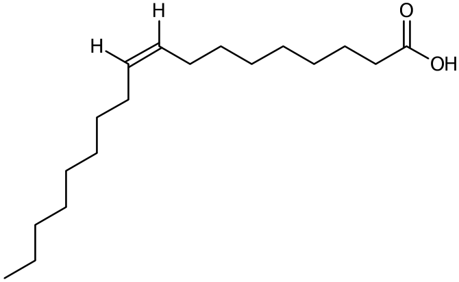

`FA 18:1(9Z)` is fully determined, so it is plain SMILES with no pipes and no trailer:

```text
FA 18:1(9Z)  →  OC(=O)CCCCCCC/C=C\CCCCCCCC
```

There is nothing to encode. The geometry is in the bond slashes.

### Unknown double-bond position

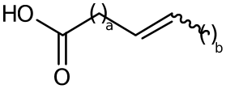

`FA 18:1` has one double bond that is somewhere in the chain but not localized. The string marks the variable stretch with `Sg:` and records its length in the trailer:

```text
FA 18:1  →  OC(=O)CC=CC |Sg:n:3:a:ht,Sg:n:6:b:ht| constrain(a+b=15)
```

The `Sg:n:` entries mark variable-length segments. The `constrain(a+b=15)` keeps the total number of carbons correct. The structure says "one double bond somewhere in an 18-carbon acyl chain", not "a double bond at the position used by this drawing".

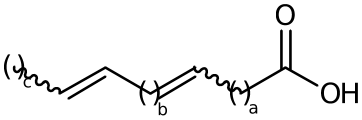

Two unlocalized double bonds:

```text
FA 18:2  →  OC(=O)CC=CC=CC |Sg:n:3:a:ht,Sg:n:5:b:ht,Sg:n:8:c:ht| constrain(a+b+c=14)
```

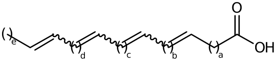

Four:

```text
FA 20:4  →  OC(=O)CC=CC=CC=CC=CC |Sg:n:3:a:ht,Sg:n:5:b:ht,Sg:n:7:c:ht,Sg:n:9:d:ht,Sg:n:12:e:ht| constrain(a+b+c+d+e=14)
```

The pattern is simple. A chain with N unlocalized double bonds needs N+1 variable regions. The sum constraint preserves the chain length.

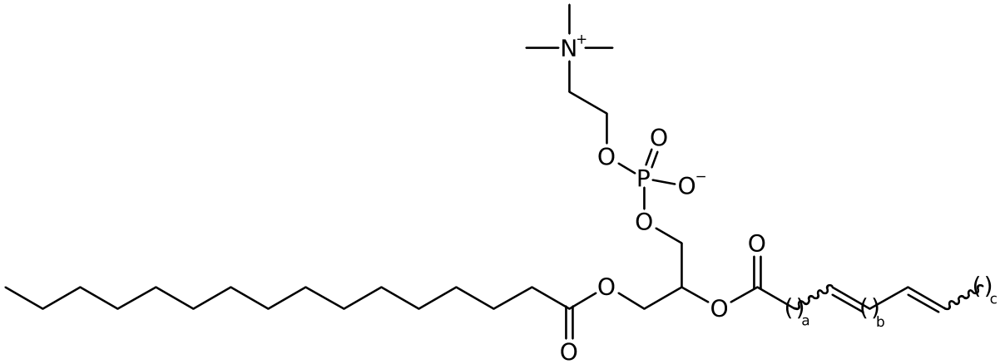

The same idea works inside a connected lipid. `PC 16:0/18:2` has resolved sn positions and a resolved chain split, but the double bonds in the 18:2 chain are not localized:

```text
PC 16:0/18:2  →  C(COP(=O)([O-])OCC[N+](C)(C)C)(OC(=O)CC=CC=CC)COC(=O)CCCCCCCCCCCCCCC |Sg:n:16:a:ht,Sg:n:18:b:ht,Sg:n:21:c:ht| constrain(a+b+c=14)
```

### Unknown modification position

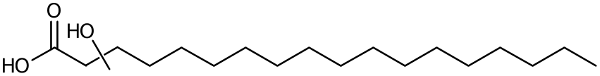

`FA 18:0;OH` has a hydroxyl that is present but not placed. It is a disconnected stub whose `m:` block lists every carbon it could sit on:

```text
FA 18:0;OH  →  OC(=O)CCCCCCCCCCCCCCCCC.*O |m:20:3.4.5.6.7.8.9.10.11.12.13.14.15.16.17.18.19|
```

The modification is an attachment ambiguity, not a variable-length stretch, so it is not an `Sg:`.

### Unresolved sn assignment

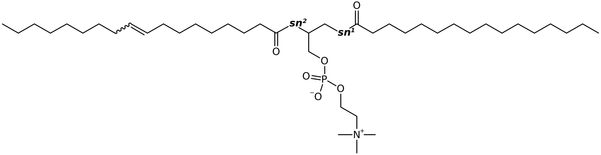

`PC 16:0_18:1(9)` has both chains and the double-bond position known, but not which chain is on sn-1 and which on sn-2. Both chains are in the main string. Each linking atom carries an `snN` label, and the trailer says they can be swapped:

```text
PC 16:0_18:1(9)  →  C(COP(=O)([O-])OCC[N+](C)(C)C)(OC(=O)CCCCCCCC=CCCCCCCCC)COC(=O)CCCCCCCCCCCCCCC |$;;;;;;;;;;;;;sn2;;;;;;;;;;;;;;;;;;;;;sn1$| swappable(sn1,sn2)
```

### The case that motivated the whole design

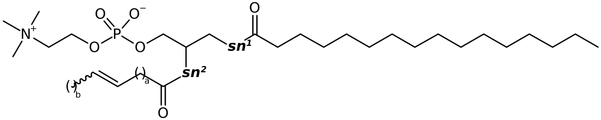

Now the hard one. `PC 16:0_18:1` has both an unlocalized double bond in the 18:1 chain and an unresolved sn assignment. The old `f:` encoding could not state both at once. The new one can, because the chains are in the main string and the two statements live in different places:

```text
PC 16:0_18:1  →  C(COP(=O)([O-])OCC[N+](C)(C)C)(OC(=O)CC=CC)COC(=O)CCCCCCCCCCCCCCC |$;;;;;;;;;;;;;sn2;;;;;;;;sn1$,Sg:n:16:a:ht,Sg:n:19:b:ht| swappable(sn1,sn2);constrain(a+b=15)
```

Two things worth noting. Each chain gets its own equation, and equations are matched to `Sg:` markers positionally, in emission order, not by variable name. Variable letters restart per chain and can repeat. A fully determined chain contributes no equation at all.

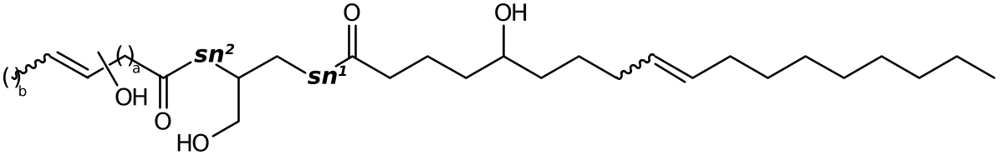

The same machinery handles a glycerolipid with everything at once. `DG 18:1(9);OH(5)_18:1;OH` has an unresolved sn assignment, one chain with a localized double bond and a localized hydroxyl, and the other chain with an unlocalized double bond and an unlocalized hydroxyl:

```text
DG 18:1(9);OH(5)_18:1;OH
→ C(CO)(OC(=O)CC=CC.*O)COC(=O)CCCC(O)CCCC=CCCCCCCCC |$;;;sn2;;;;;;;;;;sn1$,Sg:n:6:a:ht,Sg:n:9:b:ht,m:10:6.7.8.9| swappable(sn1,sn2);constrain(a+b=15)
```

This one string says several things at once: the chains may be swapped (`swappable`), one chain has an unlocalized double bond (`Sg:`), the other has an unlocalized hydroxyl (`m:`), and the variable stretch spans 15 carbons (`constrain`).

### Confidence in the trailer

![FA 18:1(9) [DB sn1: Δ9 92%]](v2_figures/fig_fa181_conf.png)

The bracketed consensus tail that instrument software puts after a name used to be thrown away. It is not anymore. `FA 18:1(9) [DB sn1: Δ9 92%]` keeps the structure byte-identical to the version without a tail, and carries the call in the trailer:

```text
FA 18:1(9) [DB sn1: Δ9 92%]  →  OC(=O)CCCCCCCC=CCCCCCCCC |$;sn1$| dbPos(sn1:9@92)
```

![FA 20:4;OH [OH sn1: 11 50%, 13 50%]](v2_figures/fig_fa204_oh_conf.png)

An unlocalized group with a split call narrows the `m:` block from "any carbon" to two candidates. `FA 20:4;OH [OH sn1: 11 50%, 13 50%]`:

```text
FA 20:4;OH [OH sn1: 11 50%, 13 50%]
→ OC(=O)CC=CC=CC=CC=CC.*O |$;sn1;;;;;;;;;;;;OH1$,Sg:n:3:a:ht,Sg:n:5:b:ht,Sg:n:7:c:ht,Sg:n:9:d:ht,Sg:n:12:e:ht,m:13:3.4.5.6.7.8.9.10.11.12| constrain(a+b+c+d+e=14);mPos(OH1:11OH@50,13OH@50)
```

The `|` inside `mPos` separates mutually exclusive candidates: position 11 or position 13, not both. The original bracketed tail is reconstructed on the way back out by `smiles2name`.

### Three chains

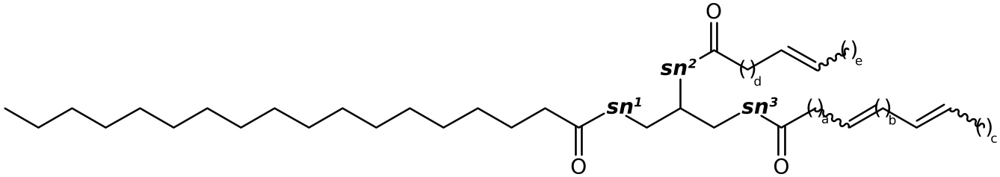

The framework scales to triacylglycerols. `TG 18:0_18:1_18:2`:

```text
TG 18:0_18:1_18:2  →  C(COC(=O)CC=CC=CC)(OC(=O)CC=CC)COC(=O)CCCCCCCCCCCCCCCCC |$;;sn3;;;;;;;;;sn2;;;;;;;;sn1$,Sg:n:5:a:ht,Sg:n:7:b:ht,Sg:n:10:c:ht,Sg:n:14:d:ht,Sg:n:17:e:ht| swappable(sn1,sn2,sn3);constrain(a+b+c=14);constrain(d+e=15)
```

The two constraints are separate because they belong to different chains. `a+b+c=14` is the 18:2 chain, `d+e=15` is the 18:1 chain.

## The demo

The repository ships a runnable demo that exercises all of this and more. It covers fully determined structures, unlocalized features, rings, epoxides, ceramides, O-alkyl ethers, and headgroup diversity, and it renders every structure through CDK Depict. A few of the more demanding examples:

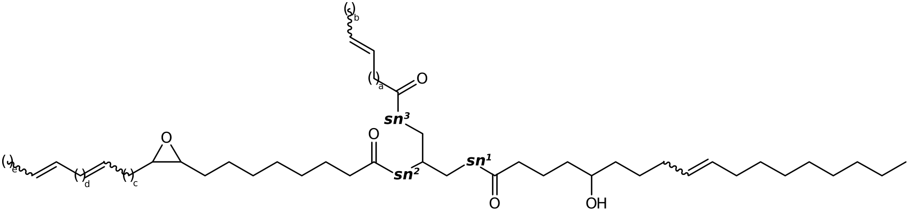

```text
TG 18:1(9);5OH_18:2;9Ep_18:1
→ C(COC(=O)CC=CC)(OC(=O)CCCCCCCC%10OC%10CC=CC=CC)COC(=O)CCCC(O)CCCC=CCCCCCCCC |$;;sn3;;;;;;;sn2;;;;;;;;;;;;;;;;;;;;sn1$,Sg:n:5:a:ht,Sg:n:8:b:ht,Sg:n:22:c:ht,Sg:n:24:d:ht,Sg:n:27:e:ht| swappable(sn1,sn2,sn3);constrain(a+b=15);constrain(c+d+e=5)
```

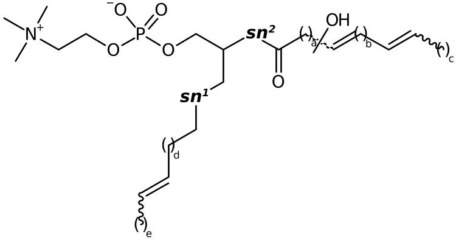

```text
PC O-16:1_18:2;OH
→ C(COP(=O)([O-])OCC[N+](C)(C)C)(OC(=O)CC=CC=CC.*O)COCCC=CC |$;;;;;;;;;;;;;sn2;;;;;;;;;;;;sn1$,Sg:n:16:a:ht,Sg:n:18:b:ht,Sg:n:21:c:ht,Sg:n:27:d:ht,Sg:n:30:e:ht,m:22:16.17.18.19.20.21| swappable(sn1,sn2);constrain(a+b+c=14);constrain(d+e=13)
```

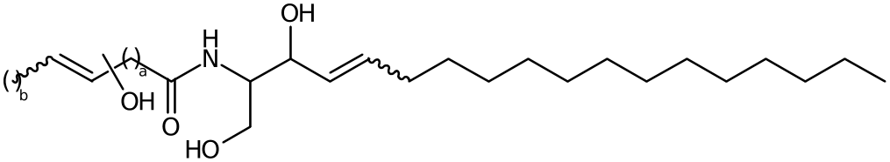

```text
Cer d18:1(4)/16:1;OH  →  C(CO)(NC(=O)CC=CC.*O)C(O)C=CCCCCCCCCCCCCC |Sg:n:6:a:ht,Sg:n:9:b:ht,m:10:6.7.8.9| constrain(a+b=13)
```

These all run through the same machinery: standard CXSMILES inside the pipes, lipid semantics in the trailer.

## Why each of these shapes

It is worth listing the constraints that pushed the design here, because each one is a thing CXSMILES genuinely cannot do.

- An `RG:` definition cannot contain a nested `|...|` block. CDK rejects it. So a chain needing an `Sg:` or `m:` block of its own could never be an R-group alternative, and `PC 16:0_18:1` had to choose between saying its double bond was unlocalized and saying its sn assignment was. It used to keep the double bond and drop the sn ambiguity silently. This is why chains are now always written into the main string and the sn statement moved to the trailer.
- A Markush R-group states the wrong cardinality. Under the ordinary reading, one label with N definitions substitutes each of its sites independently, so `PC 16:0_18:1` also admitted `PC 16:0/16:0`, and a TG permitted 27 assignments where the name allows 6. Labelled positions plus `swappable` are unambiguous.
- RDKit does not implement `RG:` at all, not even the minimal case. Dropping it means every string this crate emits now parses in both toolkits.
- `Sg:n` has nowhere to record a repeat count. Hence `constrain(...)`.
- `m:` candidate lists cannot see inside `Sg:` runs. A chain with both an unlocalized modification and unlocalized double bonds can only offer the atoms physically present in the string, so the candidate list understates the ambiguity. The safer direction, but still not the truth.
- `ctu:` and `f:` look applicable and are not. `ctu:` is a query feature for matching either geometry, and a bare `C=C` already says as much about a structure. `f:` groups components into one entity and expresses and, never the or that unresolved regiochemistry needs.
- No construct expresses weighted alternatives, so a 92% call and a 100% call would be written identically in the structure. The percentages are not lost: they move to `dbPos` and `mPos` trailer tokens.
- No construct varies a bond order within a structure, which is why sum compositions such as `PC 34:1` are rejected rather than guessed.

## What still does not work

Sum compositions such as `PC 34:1` and `PC 34:2` are still rejected. The old post explained why `PC 34:2` is a genuinely harder problem than `PC 34:1`, because the two double bonds can be distributed as `0+2` or `1+1` across the two chains. That reasoning stands, and so does the decision not to guess a chain split.

Carbohydrate sequences such as `Gal-Glc-Cer` are not converted, because they do not determine the glycosidic linkage positions. A functional group on C1 of an acyl chain can change the linkage itself and is rejected.

Confidence percentages never enter the structure. They ride in the trailer and are restored by `smiles2name`.

## Toolkit behavior, and the cost of the trailer

Both CDK and RDKit parse every string in this post. That is the point of keeping the standard inside the pipes.

The trailer is a title, and a round trip through a toolkit is lossy in a way worth knowing. The `|...|` block survives and is renumbered correctly, but a title is dropped when a toolkit rewrites the molecule. A string that went in carrying `constrain(a+b=15)` comes back with its `Sg:` markers intact and no length. Still well-formed, quietly less specific. Preserve the trailer yourself if a toolkit rewrites the molecule.

For depiction, `smiles_for_depiction` canonicalizes the string, reindexes every CX field, and places each `m:` group over a representative bond so a viewer has something deterministic to draw. The original string remains the analytical record. Renderers that ignore `Sg:` see only the fixed scaffold and produce a truncated chain. When a plain-SMILES representative is required, `smiles_expand` chooses one valid distribution of the variable lengths. That expansion is for drawing. It does not turn an unknown position into a measurement.

## Closing

I am grateful to John Mayfield for reading the old post carefully. The revision is better for it, not because the notation is prettier, but because it is honest about the boundary between what CXSMILES can say and what it cannot.

That boundary is the whole design. Standard structure goes inside the pipes. The things CXSMILES cannot express go after them, in a trailer no toolkit will mistake for structure, where they can be read back without being lost.

The goal has not changed from the first post: stop pretending one structure is known when the data only support a family of structures.

## References

- Weininger D. SMILES, a chemical language and information system. 1. Introduction to methodology and encoding rules. *Journal of Chemical Information and Computer Sciences*. 1988. DOI: [10.1021/ci00057a005](https://doi.org/10.1021/ci00057a005).
- ChemAxon. Extended SMILES and SMARTS, CXSMILES and CXSMARTS. [Documentation](https://docs.chemaxon.com/latest/formats_chemaxon-extended-smiles-and-smarts-cxsmiles-and-cxsmarts.html).
- Willighagen E, Rutz A, Ni Z. CDK CXSMILES documentation and lipid templates. [Documentation](https://egonw.github.io/cdk-cxsmiles/).
- Mayfield J. CDK Depict and CXSMILES support. [Source and issues](https://github.com/cdk/cdk).
- Liebisch G, Fahy E, Aoki J, et al. Update on LIPID MAPS classification, nomenclature, and shorthand notation for MS-derived lipid structures. *Journal of Lipid Research*. 2020. DOI: [10.1194/jlr.S120001025](https://doi.org/10.1194/jlr.S120001025).
- The converter in this post is the open source crate `lipid_notation`. [Repository](https://github.com/zamboni-lab/lipidoracle-smiles).
