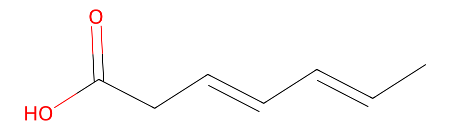
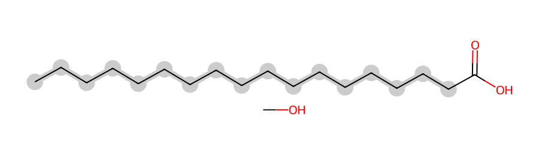
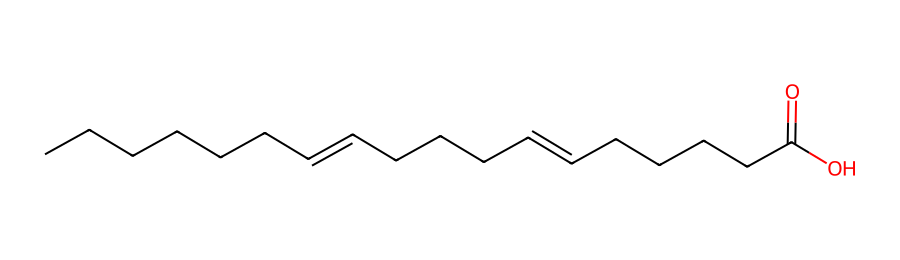

# Encoding Lipid Structural Ambiguity in CXSMILES

## The ladder of not-quite-knowing

Lipidomics has an unusually well-developed vocabulary for partial knowledge,
standardized by [Liebisch et al.
(2020)](https://doi.org/10.1194/jlr.S120001025). The same molecule can be
reported at any of several levels, each conceding a different piece of
structure:

| level | example | what's determined |
|---|---|---|
| species | `PC 34:1` | total carbons and double bonds, nothing else |
| molecular species | `PC 16:0_18:1` | the individual chains, but not their sn-positions |
| sn-position | `PC 16:0/18:1` | which chain is where |
| double-bond position | `PC 16:0/18:1(9)` | where the double bond sits |
| full stereochemistry | `PC 16:0/18:1(9Z)` | cis or trans |

Each rung down is a claim your instrument may or may not support. The problem
this document addresses is that SMILES only speaks the bottom rung, while a
lipidomics pipeline spends most of its time on the middle ones.

[CXSMILES](https://docs.chemaxon.com/latest/formats_chemaxon-extended-smiles-and-smarts-cxsmiles-and-cxsmarts.html)
(ChemAxon Extended SMILES) is a superset of SMILES that appends a `|...|` block
carrying extra semantics — Markush structures, polymers, R-groups and reaction
schemes. LipidOracle uses three of its features to say exactly what was and
wasn't determined.

An earlier revision of this document described four features, two of which were
being misused. That was corrected after review by John Mayfield; §3 records what
was wrong and what replaced it, because the mistakes are instructive and other
projects are making them. The remaining rough edges are in §4.

Every SMILES string in this document was produced by the actual generator
(`src/smiles.rs`, exposed as `name2smiles`); every image was produced by feeding
that exact string to a real depiction engine. Nothing here is idealized, and
`dev/validate_cxsmiles.py` re-checks every string in it against both toolkits
(§5).

---

# 1. Generating CXSMILES

## 1.1 The three elements

LipidOracle emits exactly three kinds of CXSMILES annotation. Each answers a
different question, and they are largely orthogonal — one chain can need two of
them at once.

One shared convention before the details: everything after the SMILES lives
between pipes, comma-separated, and the blocks index **atoms by order of
appearance in the string**, counting only actual atoms (elements, bracket
atoms, and `*`), starting at zero. Ring-closure digits and bond symbols don't
count. All three blocks share this indexing and it is the single easiest thing
to get wrong.

### Unknown geometry — nothing to write

Start with the case that needs no annotation at all, because it is the one most
easily over-engineered.

A double bond in SMILES has three states: cis, trans, or **unspecified** — and
unspecified is the default. Writing `C=C` with no `/` or `\` already says
"geometry not determined". So a chain whose double-bond positions are all known
but whose geometry is not comes out as ordinary SMILES:

```
FA 18:1(9)
↓
OC(=O)CCCCCCCC=CCCCCCCCC
```


The complement, when geometry *is* known, uses `/` and `\` in the ordinary way:

```
FA 18:1(9Z)
↓
OC(=O)CCCCCCC/C=C\CCCCCCCC
```

Note what both strings lack: any `|...|` at all. A fully determined structure
comes out as plain, ordinary SMILES, which makes the presence of a CXSMILES tail
a useful signal in itself — **pipes mean something was undetermined.**

### `Sg:` — "the double bond is somewhere in this stretch"

The load-bearing block, and the furthest from its designed purpose. `Sg` is
CXSMILES's **polymer S-group** notation, meant for describing repeating units in
polymers. LipidOracle uses it to mean "a run of methylenes whose length is a
free variable".

The field layout is `Sg:<type>:<atoms>:<subscript>:<superscript>`:

```
Sg:n:3:a:ht
   │ │ │ └── superscript: connectivity — `ht` = head-to-tail
   │ │ └──── subscript: the variable name for this run's length
   │ └────── atom indexes in the group — here just atom 3
   └──────── type `n` = SRU (structural repeating unit)
```

So each marker declares a **one-atom repeating unit** — a single `CH2` repeated
`a` times — rather than a conventional polymer block. That one-atom trick is
what makes the notation usable for chains at all, and it comes straight from the
[CDK CXSMILES cookbook](https://egonw.github.io/cdk-cxsmiles/)'s
[lipid templates](https://egonw.github.io/cdk-cxsmiles/templates.html).

```
FA 18:2
↓
OC(=O)CC=CC=CC |Sg:n:3:a:ht,Sg:n:5:b:ht,Sg:n:8:c:ht| a+b+c=14
```

Reading it:

- Three markers (`a`, `b`, `c`) for two double bonds — an **N+1 rule**: one
  flexible run before the first `C=C`, then one after each. The runs are the
  gaps *between* the fixed points, and two fixed points make three gaps.
- `a+b+c=14` — however the runs are distributed, they must total 14 carbons,
  keeping the molecule at exactly C18 with exactly 2 double bonds.
- The constraint lives *outside* the pipes, trailing after the closing `|`. It
  is **not part of the CXSMILES standard at all** — it's a LipidOracle
  convention that the CDK cookbook also uses. Nothing enforces it, and no
  toolkit reads it.


CDK draws the repeat-unit brackets, each labelled with its variable, with a
squiggle marking the crossing bond. This is a genuinely faithful picture of "two
double bonds somewhere in an 18-carbon chain": the brackets say *this stretch
has variable length*, which is exactly the claim being made.

The literal string contains only 7 carbons. The other 11 exist *only* in that
trailing equation. This is the crux of everything in §2: the base SMILES is
deliberately incomplete, and software that ignores the `|...|` block doesn't get
a truncated-but-flagged molecule, it gets a confidently wrong one.

**Trick worth knowing.** Partial localization falls out of the same mechanism
for free. `FA 18:2(9)` declares two double bonds but gives one position — Δ9 is
written literally and the *remaining* one becomes an `Sg:` run:

```
FA 18:2(9)
↓
OC(=O)CCCCCCCC=CCC=CC |Sg:n:12:a:ht,Sg:n:15:b:ht| a+b=6
```

The first 11 carbons are hard fact; only the tail is flexible, and the smaller
constant (`6`, not `14`) reflects how much chain is left to distribute. There's
no special case in the code — "N declared, K given" is the general path, with
`K = N` (fully localized, plain SMILES) and `K = 0` (nothing known) as its two
endpoints. Everything in between is the same code.

**Trick worth knowing — one atom per `Sg:` block, deliberately.** The spec says
an S-group's atom indexes are comma-separated. But blocks are *also*
comma-separated, so `Sg:n:3,4,5:a:ht` is ambiguous on its face. Emitting exactly
one atom per block sidesteps the ambiguity entirely, at the cost of more blocks.

### `m:` — "this group attaches somewhere on this chain"

Formally a **multicenter S-group**, more commonly called a *position-variation*
or *Markush* bond. Used when a modification's presence is established but its
position isn't.

```
FA 18:0;OH
↓
OC(=O)CCCCCCCCCCCCCCCCC.*O |m:20:3.4.5.6.7.8.9.10.11.12.13.14.15.16.17.18.19|
```

`m:20:3.4....19` says: atom 20 is bonded to **exactly one** of atoms 3 through
19. Not all of them — one, unspecified which. Of the three blocks this is the
one whose semantics are an exact fit for what we mean.

**The `*` is mandatory, not decorative.** Atom 20 is the `*`, not the hydroxyl
oxygen. A position-variation bond's variable end has to be a dummy atom carrying
exactly one bond, and both toolkits enforce it:

- CDK **silently ignores** an `m:` block whose target is anything else.
- RDKit **rejects the whole string**: `position variation bond to atom with more
  than one bond`.

So the component is `*O` — the `*` takes the variable bond, the `O` is the
hydroxyl it carries. Because the dummy supplies the free valence, no explicit
hydrogen count is needed and the oxygen adds no carbon, so the formula stays
exact. The other two forms follow the same shape: `*=O` for an unlocalized
ketone (which converts an existing chain carbon), and `*C(=O)O` for an extra
carboxyl, which does bring a carbon of its own:

```
FA 18:0;COOH
↓
OC(=O)CCCCCCCCCCCCCCCCC.*C(=O)O |m:20:3.4.5.6.7.8.9.10.11.12.13.14.15.16.17.18.19|
```


**Trick worth knowing — the candidate list excludes C1.** For an acyl chain, C1
is the ester carbonyl: not a substitutable methylene, so it never appears. The
list starts at C2, which is why the example above begins at atom 3 rather than
atom 1 — and why it holds 17 entries for an 18-carbon chain.

**A positioned modification is not ambiguous and gets no block.** `;5OH` is
drawn at C5 like any other atom. `m:` is only ever for the position-less form.

### `RG:` — "either chain could be at either position"

An **R-group** (Markush) definition, used when MS2 gives you the chain inventory
but not which chain is esterified at which sn-position.

```
PC 16:0_18:1(9)
↓
C(COP(=O)([O-])OCC[N+](C)(C)C)(O*)CO* |$;;;;;;;;;;;;;;R1;;;R1$,RG:_R1={C(=O)CCCCCCCCCCCCCCC},{C(=O)CCCCCCCC=CCCCCCCCC}|
```

Three parts:

- The backbone `C(COP(...)...)(O*)CO*` is the glycerophosphocholine skeleton
  with a `*` **R-group slot** at each ester position.
- The **atom-label block** `$;;…;R1;;;R1$` marks which atoms those are. Labels
  are positional and `;`-separated, one slot per atom of the SMILES in emission
  order, running only as far as the last labelled atom. Here the two non-empty
  slots are 14 and 17, the two `*` atoms.
- The **`RG:` block** gives what `R1` may be: `RG:_R1={...},{...}`, one
  definition per chain. The first atom of a definition is implicitly its
  attachment point, so C1 of the chain bonds to the `O` carrying the `*`.


**The ester oxygen stays on the backbone.** Each definition therefore holds all
of its chain's own carbons: count the carbons in `{C(=O)CCCCCCCCCCCCCCC}` and you
get 16, not 15. This is the most common off-by-one when hand-writing these.

**What `RG:` still can't say.** Two `R1` sites with two definitions also permits
both sites taking the *same* definition — the notation cannot express "one of
each". That is a limit of the construct rather than a misuse of it.

The label block is a real bookkeeping hazard: CDK accepts a misplaced label
without complaint and draws a picture that looks fine and means something else.
`r_group_labels_land_on_wildcard_atoms` in the test suite asserts every `R1`
slot lands on a `*`, because eyeballing the depiction cannot catch this.

## 1.2 Combining them, and where they collide

`Sg:` and `m:` compose freely. Here is a name that needs both, on the same
chain:

```
DG 18:1(9);5OH_18:1;OH
↓
C(CO)(OC(=O)CC=CC.*O)COC(=O)CCCC(O)CCCC=CCCCCCCCC |Sg:n:6:a:ht,Sg:n:9:b:ht,m:10:6.7.8.9| a+b=15
```

| what's unknown | which block | evidence in the string |
|---|---|---|
| the 18:1;OH chain's double-bond position | `Sg:` | `Sg:n:6:a:ht,Sg:n:9:b:ht` + `a+b=15` |
| that chain's hydroxyl position | `m:` | `m:10:6.7.8.9` |


Chain 1 (`18:1(9);5OH`) is fully localized — both its double bond and its
hydroxyl are written literally into the string — so it contributes no block at
all. Chain 2 (`18:1;OH`) knows neither, and contributes both. The two chains sit
side by side in one string at completely different rungs of the ladder from the
introduction. That is the normal case, not an edge case: evidence arrives per
chain, not per molecule.

**Trick worth knowing — `m:` candidate lists shrink when `Sg:` is present.**
Look closely at `m:10:6.7.8.9`. Four candidate atoms, on an eighteen-carbon
chain. The list is not truncated by mistake: carbons C6–C18 of that chain *do
not exist as atoms in this string*. They're inside the `Sg:` flexible runs,
which have no atoms until expanded. The `m:` block can only enumerate atoms that
are actually written down, so the stored candidate list understates the real
ambiguity. This is an expressiveness gap in the representation, not just in our
generator; see §4.3.

**Trick worth knowing — each chain gets its own constraint equation.**
Comma-joined, and matched to `Sg:` markers *positionally*, in emission order:

```
TG 18:0_18:1_18:2
↓
C(COC(=O)CC=CC=CC)(OC(=O)CC=CC)COC(=O)CCCCCCCCCCCCCCCCC |Sg:n:5:a:ht,Sg:n:7:b:ht,Sg:n:10:c:ht,Sg:n:14:d:ht,Sg:n:17:e:ht| a+b+c=14,d+e=15
```

`a+b+c=14` consumes the first three markers (the 18:2 chain), `d+e=15` the next
two (the 18:1 chain). Matching is by order, not by variable name — which matters
more than it should, for reasons covered in §4.1. Note also that the saturated
18:0 chain contributes to neither equation: it is fully determined, so it is
simply written out.

### `RG:` and `Sg:` cannot coexist

This is the sharpest structural limit in the whole design, and it is not
obvious from the spec.

`Sg:` marks atoms of the **main** SMILES. `RG:` moves the chains **out** of the
main SMILES and into `{...}` definitions. The obvious fix is to nest a block
inside a definition — and CDK rejects that outright:

```
C(O*)CO* |$;;R1;;R1$,RG:_R1={C(=O)CC=CC |Sg:n:2:a:ht,Sg:n:4:b:ht|},{C(=O)CCC}|
→ HTTP 400, Error parsing CXSMILES
```

Nesting fails even in the form the spec documents for attachment points
(`{*C(=O)CCC |$_AP1$|}`). `Sg:` and `RG:` *can* sit side by side in the outer
block, but only with `Sg:` pointing at main-string atoms — which the chains are
no longer in.

So a name like `PC 16:0_18:1`, where the sn-position and a double-bond position
are both unknown, can only express one of the two. **LipidOracle keeps the
double bond**, because that is what the EAD evidence actually speaks to:

```
PC 16:0_18:1
↓
C(COP(=O)([O-])OCC[N+](C)(C)C)(OC(=O)CC=CC)COC(=O)CCCCCCCCCCCCCCC |Sg:n:16:a:ht,Sg:n:19:b:ht| a+b=15
```

No `RG:`. The chains are esterified in place, in name order, and the sn order
shown is arbitrary — with **nothing in the string saying so**. The `_` in the
lipid name is the only surviving record. §4.2 takes this up as the open problem
it is.

---

# 2. Depiction

Generating a correct CXSMILES string is the easy half. Getting a *picture* out
of it is where the ecosystem stops cooperating — and pictures matter, because
the structure thumbnail is what most users actually look at.

## 2.1 What CDK and RDKit actually support

Both toolkits claim CXSMILES support. Neither implements all of it, and — this
is the important part — **they don't implement the same subset.**

Tested against [CDK](https://cdk.github.io/) via the
[CDK Depict service](https://www.simolecule.com/cdkdepict/depict.html) and
RDKit 2024.09.6:

| block | CDK | RDKit |
|---|---|---|
| plain `C=C` (unspecified geometry) | ✅ | ✅ |
| `Sg:` + size constraint | ✅ renders as labelled repeat brackets | ❌ **silently ignored** |
| `m:` (`*O` dummy-stub form) | ✅ collapses to one concrete position | ✅ highlights all candidate atoms |
| `RG:` + `$...$` labels | ✅ renders a Markush scheme | ❌ **hard parse failure** |
| nested block inside an `RG:` definition | ❌ hard parse failure | ❌ |

Two rows deserve alarm.

**`Sg:` in RDKit is silently ignored.** Not warned about. Not errored on. RDKit
parses the base SMILES, discards the block, and hands you a molecule:

```python
>>> m = Chem.MolFromSmiles("OC(=O)CC=CC=CC |Sg:n:3:a:ht,Sg:n:5:b:ht,Sg:n:8:c:ht| a+b+c=14")
>>> rdMolDescriptors.CalcMolFormula(m)
'C7H10O2'
```

That is a valid `Mol` object for a seven-carbon diene acid. The input described
an eighteen-carbon one. No exception, no warning — an eleven-carbon error that
propagates into any mass, formula, or similarity calculation downstream, and
that nothing in the object flags as suspect.




The RDKit picture isn't a degraded rendering of the right answer. It's a picture
of a different molecule, drawn with no indication that anything was dropped.
**Always expand before handing a stored string to RDKit.**

**`RG:` in RDKit is a hard parse failure.** RDKit implements no R-group support
whatsoever — not even the minimal `C* |$;R1$,RG:_R1={C}|` — and returns `None`
for the whole string. This is a real cost of the encoding, and it was adopted
knowingly: `RG:` is what the construct is *for*, and RDKit's gap doesn't make
the alternative correct. The mitigation is that
`expand_cxsmiles_for_depiction` strips the block, and `name2structure` never
uses the `RG:` form at all (§2.3).

## 2.2 The one where RDKit wins

`m:` is the block RDKit handles better than CDK, and it is worth seeing why.

`OC(=O)CCCCCCCCCCCCCCCCC.*O |m:20:3.4.5.6.7.8.9.10.11.12.13.14.15.16.17.18.19|`

RDKit renders the position variation properly, highlighting every candidate
carbon in grey with the `-OH` drawn once:



That is, by a wide margin, the best depiction in this entire document. It shows
the modification, shows the set of places it could be, and commits to none of
them. CDK accepts the same string but collapses it, drawing the hydroxyl at one
arbitrary candidate position — connected and with the right heavy-atom count,
but making a positional claim the data doesn't support.

### The multi-chain problem, and why the dummy stub solves it

On a lipid with two, three or four acyl chains, an unassigned modification is
not merely imprecise — without the `m:` block it becomes genuinely
unassignable. Not just *where* on the chain, but *which chain*.

```
TG 16:0/18:0/18:1(9);OH
↓
C(COC(=O)CCCCCCCC=CCCCCCCCC.*O)(OC(=O)CCCCCCCCCCCCCCCCC)COC(=O)CCCCCCCCCCCCCCC |m:22:5.6.7.8.9.10.11.12.13.14.15.16.17.18.19.20.21|
```

Atoms 5–21 are the carbons of the 18:1 chain and nothing else, so the stored
string resolves the chain exactly and states only the ambiguity the annotation
actually asserts. RDKit's candidate highlighting shows this directly: because
every highlighted atom lies on one chain, the picture answers "which chain" and
"where along it" in the same stroke.

This is the payoff from the dummy-stub form. The previous encoding wrote the
modification as a floating bracket atom (`.[OH]`), which failed to parse in
RDKit and drew as a detached radical in CDK — leaving a lone `•HO` next to a
three-chain lipid with no basis whatsoever for attributing it. §3.2 has the
details.

## 2.3 Expansion: trading rigor for a picture

Because of everything above, LipidOracle keeps two forms of every structure.

**The stored form** is the CXSMILES written into the `smiles` column. It is the
rigorous one: every uncertainty explicitly marked, nothing asserted that wasn't
measured. This is what you cite, archive, and reason over.

**The depiction form** is produced on demand by `expand_cxsmiles_for_depiction`
and never stored. It is a plain SMILES that any renderer can draw. Getting there
is deliberately lossy.

The main step is **`Sg:` expansion**. Each constraint equation is solved by
picking one valid even split across its variables, and the corresponding number
of `CH2` carbons is inserted after each marker (each marker atom already counts
as the first unit of its run, so a run of length *n* needs *n−1* insertions):

```
stored:    OC(=O)CC=CC=CC |Sg:n:3:a:ht,Sg:n:5:b:ht,Sg:n:8:c:ht| a+b+c=14
                                                         ↓  a=4, b=4, c=6
depicted:  OC(=O)CCCCC=CCCCC=CCCCCCC
```

The expanded string is now C18 with the right degree of unsaturation, and draws
correctly in every tool:




**What this costs.** The picture now shows double bonds at Δ6 and Δ11. The data
said "somewhere". Any single even split is as valid as any other — that's the
whole point of the ambiguity — but a depiction has to commit to one, and a
reader has no way to tell a depicted Δ6 from a measured one. The expanded form
is a *representative candidate*, not the answer. It is also, unlike the CDK
bracket rendering, indistinguishable from a real determination — precisely the
sin this whole project exists to avoid. The compromise is accepted only because
the alternative in most tools is a seven-carbon molecule.

**The position-variation stub is not rewritten.** `*O` survives into the
depiction form unchanged: it is both the form `m:` requires and a legible `R–OH`
stub, and it adds no carbon, so the depicted formula matches the stored one. An
earlier revision stored `[OH]` and swapped it for `CO` on the way to a picture,
which made every depicted unlocalized modification one carbon too heavy. Both
halves of that trade are gone (§3.2).

**A second, subtler step.** For `_`-joined names, `name2structure` builds the
molecule *as if* it were `/`-joined, arbitrarily assigning chains to
sn-positions. A Markush scheme is not a molecule, and the per-atom highlighting
a structure viewer needs requires concrete atoms. The arbitrary choice is
flagged on the returned struct
(`regio_resolved: false`) so the UI can label it, but the picture itself makes a
claim the name explicitly declines to make. The honesty has been moved out of
the image and into a caption — which works only as long as the caption travels
with the image, and it usually doesn't.

## 2.4 Things that aren't possible

### Ambiguity cannot be composed with itself

There is no way to write "either a hydroxyl at C5, or a double bond at C9, but
not both". CXSMILES ambiguity blocks are independent axes: `m:` varies a
position, `Sg:` varies a length, `RG:` varies a substituent. Nothing correlates
them, and nothing lets one alternative's resolution constrain another's. Every
spectrum that supports two *mutually exclusive* structural hypotheses has to be
reported as two rows, not one string. Since mutually exclusive hypotheses are
the normal output of a scoring engine, this is a bigger limitation than it first
appears.

The `RG:`/`Sg:` collision in §1.2 is the same problem in a more concrete form:
two axes of ambiguity that cannot be written down together.

### Rings are not rendered at all

Epoxides and cyclopropanes parse and then vanish — see §4.5, where this belongs
under "broken" rather than "impossible".

---

# 3. What was wrong before

This section exists because the three corrections below were not obvious, two of
them survived a full test suite for a long time, and at least one of them is
being made by other projects. All three came out of review by John Mayfield.

## 3.1 `ctu:` is a query feature, and was never needed

Earlier versions annotated every geometry-unknown double bond with a `ctu:`
(cis/trans-unspecified) block, listing CXSMILES **bond** indices:

```
OC(=O)CCCCCCCC=CCCCCCCCC |ctu:10|      ← what we used to emit
OC(=O)CCCCCCCC=CCCCCCCCC      ← what we emit now
```

The reasoning was that a plain `C=C` blurs "we didn't measure it" into "we
didn't bother writing it down", and `ctu:` made the absence explicit. That
reasoning was wrong on both counts:

- **A plain `C=C` already means unspecified.** It is one of the three legal
  states of a SMILES double bond, not an omission. There was nothing to add.
- **`ctu:` is a query feature**, for matching either configuration when
  *searching* — and largely a ChemAxon-specific one, since SMARTS expresses the
  same thing directly (`C/C=C/?\?C`) and most toolkits treat an undecorated
  `C=C` as matching either geometry anyway. Emitting it turned every
  partially-determined *structure* into a query.

It rendered attractively — CDK drew a wavy bond, RDKit a crossed double bond,
both the conventional symbol for undefined geometry — which is exactly why it
went unquestioned. Removing it deleted the block, its `cpu_atoms` plumbing, and
~75 lines of bond-index arithmetic that existed only to feed it. Nothing was
lost: the depiction path already stripped the whole `|...|` block, so no picture
changed.

## 3.2 The `m:` encoding was inert

The modification was written as a floating bracket atom, chosen for chemical
exactness — `[OH]` is a hydroxyl with one free valence, and it adds no carbon
the chain doesn't have:

```
OC(=O)CCCCCCCCCCCCCCCCC.[OH] |m:20:3.4....19|     ← what we used to emit
OC(=O)CCCCCCCCCCCCCCCCC.*O |m:20:3.4.5.6.7.8.9.10.11.12.13.14.15.16.17.18.19|   ← what we emit now
```

Exact, and useless. A position-variation bond's variable end must be a `*` dummy
with exactly one bond; anything else is ignored. So CDK dropped the block and
drew a detached `•HO` radical, and RDKit rejected the string outright. The
`m:` block was decorative in one toolkit and fatal in the other.

Worse, the workaround compounded it. Because the floating `[OH]` drew as
apparent contamination, a `DEPICTION_SWAPS` table rewrote it to `CO` (methanol)
on the way to a picture — chemically wrong, adding a carbon the molecule does
not have, so every depicted `;OH` lipid was C+1. A second hack emitted the
floating component adjacent to its own chain's substring, hoping the layout
engine would keep them near each other; it doesn't.

The `*O` form needs none of this. It parses in RDKit, renders informatively in
both toolkits, adds no carbon, and resolves the multi-chain attribution problem
(§2.2). Both hacks and the swap table are deleted.

## 3.3 `f:` was the wrong construct entirely

The worst of the three, because it was not a misuse of a detail but of the whole
block. Unresolved sn-regiochemistry used to be written as dot-separated chain
components tied together by an `f:` group:

```
C(COP(...)...)(O*)CO*.*C(=O)CCCCCCCCCCCCCCC.*C(=O)CCCCCCCC=CCCCCCCCC |f:0.1,0.2,ctu:44|
```

`f:` groups several components into **one entity** — its designed use is salts
and hydrates, and mainly for laying out reaction schemes nicely. It expresses
*and*, never *or*. It cannot say "this chain **or** that chain sits at sn-1", and
`f:0.1,0.2` — reusing component 0 in two groups — asserts that the backbone is
simultaneously part of two different molecules, which no physical fragment can
be.

The correct construct is an R-group, and it is strictly more expressive: `RG:`
draws a real Markush scheme in CDK, where `f:` drew loose fragments in both
toolkits and communicated "the software failed" to anyone reading a results
table.

The cost is real and was accepted knowingly: RDKit parses `f:` and does not
parse `RG:`. But `f:` was parsed and then *ignored* — `f:0.1,0.2`, `f:0.1.2`,
and omitting the block entirely all produced the same three disconnected
fragments — so what RDKit lost was the ability to read a string that never meant
what it said.

## 3.4 Why the tests didn't catch any of it

All three encodings passed a suite of 64 tests. Every one of those tests
compared the generated string against an expected literal, which catches
regressions and *cannot* catch a misconception: if the expected literal was
wrong from the start, the test enshrines it forever. §4.6 of the previous
revision predicted this failure mode in the abstract; it turned out to have
already happened three times.

The suite now also checks properties no literal can express — that every `m:`
target is a `*`, that every `R1` label lands on a wildcard, that no block is a
query feature, and that every chain's carbon count matches the count declared in
its name. And `dev/validate_cxsmiles.py` asks the two questions that can only be
asked outside this crate: does RDKit parse it, and does CDK render it (§5).

---

# 4. Things that still don't work

Each of these is a real limitation, and most of them we'd welcome ideas on.

## 4.1 Variable names run out at ten

Variable letters cycle `a`..`j` and then wrap. A cardiolipin with four
unlocalized 18:2 chains needs twelve, and collides:

```
CL 18:2_18:2_18:2_18:2
↓
... |Sg:n:12:a:ht,...,Sg:n:50:j:ht,Sg:n:52:a:ht,Sg:n:55:b:ht| a+b+c=14,d+e+f=14,g+h+i=14,j+a+b=14
```

The fourth constraint is `j+a+b=14`, reusing `a` and `b` from the first. Read as
algebra this is inconsistent — it forces `c=j`, which was never intended, and
over-constrains a system meant to have four independent solutions.

Internally this is survivable because `expand_cxsmiles_for_depiction` matches
constraints to `Sg:` markers **positionally**, in emission order, never by name.
But the *string* is wrong, and any third party who reads it as algebra — the
only reasonable reading, and the one the notation invites — gets a wrong answer.
The fix (multi-letter variables, `a1`, `a2`, …) is easy; whether CDK accepts
multi-character variable names in an `Sg:` subscript is the open question, and
since the constraint equation isn't part of the standard anyway, there may be no
authority to appeal to.

## 4.2 Unresolved sn-position is lost whenever a chain needs `Sg:`

Established in §1.2: `RG:` needs the chains inside definitions, `Sg:` needs them
in the main string, nesting is rejected, so a name with both kinds of ambiguity
can only express one. We keep `Sg:`, which means `PC 16:0_18:1` — one of the
most common shapes real data takes — emits a string whose sn assignment is
arbitrary and unmarked.

Nothing false is *asserted* about positions, and the arbitrary order is
deterministic, but a reader of the SMILES column alone cannot tell this string
apart from a genuinely sn-resolved one. That is the same sin as §2.3's expansion,
except here it is in the stored form rather than only in the picture.

Two things would fix it, neither available: a construct meaning "an S-group
inside an R-group definition", or some way to mark a bond as
"connectivity undetermined" independent of substituent identity. We'd welcome a
ruling on whether either exists.

## 4.3 `m:` candidate lists can't see inside `Sg:` runs

Covered in §1.2: when a chain has both an unlocalized modification and
unlocalized double bonds, the `m:` candidate list can only enumerate atoms that
physically exist in the string, so it omits every carbon hidden inside an `Sg:`
run. `m:10:6.7.8.9` on an 18-carbon chain lists four candidates where the truth
is closer to seventeen.

This understates the ambiguity — the safer direction than overstating it, but
still wrong, and wrong in a way that looks like precision. Fixing it properly
needs a construct meaning "any atom in this repeat unit", which we don't believe
CXSMILES has. The two blocks were designed independently, for unrelated
purposes, and simply don't compose.

## 4.4 Consensus percentages have nowhere to live

The big one, and the reason this document exists.

### What idlevel4 is

LipidOracle's EAD engines localize double bonds by matching observed fragment
ions against predicted ones for every candidate isomer. Usually no single isomer
wins outright — several score similarly, because the diagnostic fragments that
would separate them are weak, absent, or shared. Rather than discard the
runners-up or report a false certainty, the engine aggregates them into an
**idlevel4** name carrying a per-position consensus, computed as a
softmax-weighted vote across the kept candidates. That aggregation lives
upstream, in LipidOracle's EAD engines rather than in this crate; what matters
here is the shape of the name it produces:

```
FA 18:2(9~92%,12~88%);OH(11~64%)
```

Read: 92% of the (score-weighted) surviving candidates put a double bond at Δ9,
88% put one at Δ12, and 64% put the hydroxyl at C11. That is an honest, precise,
information-dense statement about what the spectrum supports — it distinguishes
a position the data nails from one it merely leans toward. It is the single most
valuable thing the EAD pipeline produces.

### It cannot be turned into a structure

The SMILES generator does not accept it:

```
name2smiles("FA 18:2(9~92%,12~88%);OH(11~64%)")  →  None
```

There is no `~` in SMILES, and more fundamentally there is no CXSMILES construct
for *weighted* alternatives. `m:` says "one of these positions" with no way to
add "and this one is far more likely". `Sg:` says "somewhere in this run",
uniformly. `RG:` says "one of these substituents", uniformly. None of them
records a distribution. **Ambiguity in these formats is uniformly distributed by
construction; our evidence is not.** That mismatch isn't a gap in our
implementation — it's a gap in the formats.

### What we do instead, and what it costs

Upstream, LipidOracle rewrites the consensus name into something this
generator *can* parse, using a hard **>50% majority threshold**:

- A position with **>50%** support becomes a *known, localized* position.
- A position **below 50%** is dropped from the position list — but the declared
  double-bond *count* is left unchanged, so the leftover bond re-enters through
  the ordinary "N declared, K given" path and comes out as an `Sg:` run.
- A modification with support but no single majority position degrades to a
  bare, position-less token (`;OH`), keeping the formula right even though the
  position is abandoned.

So our example becomes `FA 18:2(9,12);OH(11)`, and renders as:

```
OC(=O)CCCCCCCC=CC(O)C=CCCCCC
```


A clean, fully localized structure. **Every trace of the uncertainty is gone.**
The 64%-supported hydroxyl at C11 is drawn with exactly the same confidence as
the 92%-supported double bond at Δ9, and both look identical to a position
determined with no ambiguity whatsoever. A reader of the SMILES column cannot
distinguish a 51% call from a 100% call — the representation has flattened a
probability distribution into a point estimate and discarded the error bars.

The threshold is also a cliff. Consider a chain where the evidence splits
`9~55%` / `11~45%` versus one that splits `9~45%` / `11~40%` / `13~15%`. The
first crosses 50% and is drawn as a hard Δ9. The second has no majority, so the
bond stays unlocalized and comes out as an `Sg:` run:

```
FA 18:2(9)   (only one of two positions reached majority)
↓
OC(=O)CCCCCCCC=CCC=CC |Sg:n:12:a:ht,Sg:n:15:b:ht| a+b=6
```


Two nearly identical evidence states, two categorically different structures. A
10-percentage-point shift flips the output between "certain" and "unknown", with
nothing in between — the one thing a continuous confidence measure should never
produce.

**The workaround, and why it's unsatisfying.** The full annotation CSV preserves
the complete `~percentage` notation and lists every individual candidate as
idlevel3 rows. Nothing is lost *from the pipeline* — it's lost from the
structure representation. But the SMILES column is what gets copied into
supplementary tables, submitted to repositories, and read by other software. The
consensus lives in a column most consumers never open, which in practice means
it doesn't survive publication.

**What we'd want.** Some way to attach a weight to a position-variation
candidate — conceptually `m:20:3;0.92.4;0.08` — so a depicter could shade
candidates by confidence and a parser could carry the distribution through. As
far as we can tell no such construct exists in CXSMILES, no toolkit would render
it, and inventing a private extension would move the interoperability problem
rather than solve it. Ideas very welcome.

## 4.5 Rings parse and then silently disappear

Epoxides and cyclopropanes are accepted by the parser and then dropped from the
output entirely, with no error:

```
FA 18:0;ep(5)  →  OC(=O)CCCCCCCCCCCCCCCCC
```

That is plain stearic acid, C18H36O2. An epoxystearate is C18H34O3. The output is
not ambiguous or degraded — it is **a different molecule, reported as fact**, and
nothing in the string or the return value signals it. Of everything in this
document, this is the one outright bug rather than a design trade-off: the
generator should return `None` until ring rendering is implemented, since silence
is strictly better than fabrication.

The SMILES itself isn't hard — `C1OC1` for an epoxide, `C1CC1` for cyclopropane.
The work is in the atom-index bookkeeping that every `Sg:`/`m:`/`$...$` offset
depends on: ring-closure digits break the "one atom per token" assumption the
index arithmetic makes, and every downstream offset would need to account for
them.

## 4.6 There is still no round trip

Nothing reads our CXSMILES back into a lipid name. The mapping is one-way, so
there's no parser-level check that the string means what the name meant.

`dev/validate_cxsmiles.py` now closes part of the gap — it proves every emitted
string parses in RDKit and renders in CDK, and the Rust suite checks per-chain
carbon counts against the counts declared in the name, which is an independent
statement rather than a recorded literal. What neither does is verify that the
*blocks* say what the name says. A CXSMILES → name reader remains the strongest
validation available, and would additionally let LipidOracle ingest structures
from other tools, which it currently cannot do at all.

## 4.7 Shorthand is rejected, and maybe shouldn't be

`PC 34:1` returns `None`. The reasoning is sound — 34 carbons and one double bond
across two chains has many realizations (16:0/18:1, 14:0/20:1, …), and picking
one would be a fabrication of exactly the sort this document is about.

But "many realizations" is exactly the situation `RG:` and `Sg:` exist for, and
species-level shorthand is what the majority of published lipidomics data
actually contains. Refusing to emit anything means the most common case in the
field gets no structure at all — the top rung of the ladder from the introduction
is the one rung we don't serve. A backbone with two R-group slots and a global
carbon-count constraint spanning both chains would be more useful than nothing,
and would degrade gracefully as evidence improves. Whether a constraint spanning
two separate chains can be expressed at all is the same composition problem as
§4.3.

---

# 5. Reproducing everything here

Entry points:

- `name2smiles(name) -> Option<String>` — the stored CXSMILES.
- `name2structure(name) -> Option<LipidStructure>` — depiction-ready plain
  SMILES plus per-chain atom indices, for highlighting which part of a structure
  a given MS2 fragment came from.
- `expand_cxsmiles_for_depiction(smi) -> String` — stored → depictable.
- `smiles2name(smi) -> Option<String>` — **not implemented**; see §4.6.

```bash
cargo test                                    # unit, golden and property tests
python dev/validate_cxsmiles.py               # RDKit parse checks, offline
python dev/validate_cxsmiles.py --cdk         # also render every string via CDK

cargo run --example bless_testdata            # after a deliberate encoding change
```

The corpus is defined once, in `testdata/name2smiles.csv`, and includes every
worked example in this document — so a change in encoding cannot leave the
documentation quietly describing a string the generator no longer emits. The
per-chain carbon counts in `testdata/chains.csv` are written by hand and are
never regenerated: they are an independent statement of what each string has to
contain, which is the only kind of expectation a golden file cannot provide.

CDK depictions were generated with the
[CDK Depict](https://www.simolecule.com/cdkdepict/depict.html) web service
(`.../depict/bow/png?smi=<urlencoded>&zoom=2.0`); the CXSMILES `|...|` block must
be percent-encoded along with the rest of the string, trailing constraint
included. RDKit images came from RDKit 2024.09.6 via
`rdMolDraw2D.MolDraw2DCairo`.

---

## References

- **SMILES** — Weininger D. *SMILES, a chemical language and information system.*
  J Chem Inf Comput Sci, 1988.
- **Lipid shorthand and ID levels** — Liebisch G, et al. *Update on LIPID MAPS
  classification, nomenclature, and shorthand notation for MS-derived lipid
  structures.* J Lipid Res, 2020;61(12):1539–1555.
  [doi:10.1194/jlr.S120001025](https://doi.org/10.1194/jlr.S120001025)
- **CXSMILES specification** — [ChemAxon Extended SMILES and SMARTS](https://docs.chemaxon.com/latest/formats_chemaxon-extended-smiles-and-smarts-cxsmiles-and-cxsmarts.html)
- **CDK CXSMILES cookbook** — Willighagen E, Rutz A, Ni Z.
  [egonw.github.io/cdk-cxsmiles](https://egonw.github.io/cdk-cxsmiles/) —
  in particular the [lipid templates](https://egonw.github.io/cdk-cxsmiles/templates.html).
- **CDK** — [The Chemistry Development Kit](https://cdk.github.io/)
- **CDK Depict** — [simolecule.com/cdkdepict](https://www.simolecule.com/cdkdepict/depict.html)
- **RDKit** — [rdkit.org](https://www.rdkit.org/)
- **Markush interpretation / `m:` blocks** — Sayle R. *Markush Interpretation:
  the treatment of variable atom types and bond types in structure
  representations.* ACS, 2017.
  [slides](https://www.nextmovesoftware.com/talks/Sayle_MarkushInterpretation_ACS_201708.pdf)
- **Lipid nomenclature** — IUPAC-IUBMB Lipid Nomenclature Standards.
- **Lipid modifications** — Fahy E, et al. *Lipid classification, structures and
  tools.* PMC7707175, Tables 1A–C.

---

**Implementation:** `src/smiles.rs` · **Validation:** `dev/validate_cxsmiles.py`
· **Verified against:** RDKit 2024.09.6, CDK Depict (accessed 2026-08-10)
